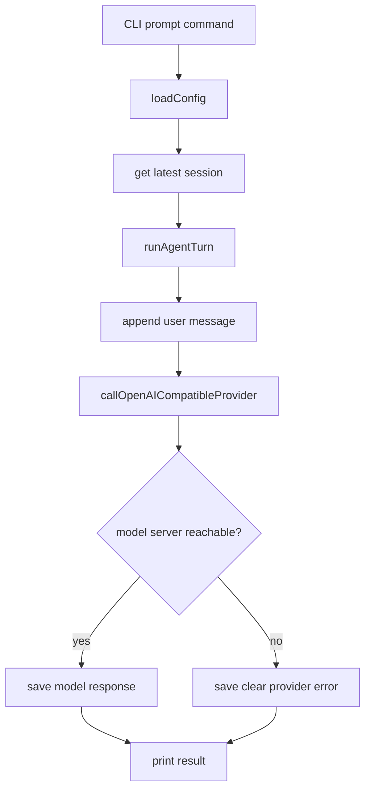

# Day 2: Model Provider

Date: 2026-06-10

## Goal

Replace the Day 1 placeholder assistant response with a real model-provider call path.

The project still does not require a local model to be running. If no model server is available, the harness returns a clear provider error and saves it to the session.

## What Changed

- Added `src/provider/openaiCompatibleProvider.js`.
- Updated `src/core/agentLoop.js` to call the provider.
- Kept a graceful fallback when `http://localhost:8080/v1/chat/completions` is not reachable.
- Added `modelTimeoutMs` so an unavailable local model server fails fast instead of hanging the CLI.
- Added `ModelProviderError` with error kinds for `network`, `timeout`, `http`, `invalid_json`, and `invalid_schema`.

## Borrowed Design Idea

From `claude-code-analysis`, the useful idea is not the specific provider code.

The useful idea is the separation:

```text
agent loop
  -> provider abstraction
  -> model endpoint
```

This keeps model access separate from CLI and session logic.

## Current Flow



## Why This Matters

This is the first point where the project stops being a static skeleton and starts becoming a real harness.

The model is still outside the project. The harness connects to it through a stable interface.

That is the right architecture because local models, remote models, vLLM, llama.cpp, and other backends can all fit behind the same provider boundary later.
